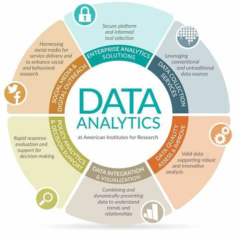

# SkillHarvest-Data-Documentation

## Project Overview
In the dynamic landscape of e-commerce, understanding customer behavior is crucial for personalized marketing strategies and overall business growth. This project focuses on leveraging data analysis techniques to segment customers and derive actionable insights from their interactions with an e-commerce platform.

## Data Sources
Sales Data:
- Transaction history including purchase amounts, dates, and products bought.
- Customer details like customer IDs, names, and addresses.

## Tools Used
- MS Excel for Data Cleaning [Download Here](https.google.com)
- SQL Server (For Querying and Analysis)
- Power BI (For Reporting)
- MS Power Point (For Presenting)

## Data Cleaning and Preparation
Exploratory Data Analysis involves exploring the data to answer some questions such as;
- What is the overall sales trend?
- Which products are top sellers?

## Data Analysis
This is where we include some basic lines of code or queries used during my analysis

```
SQL

SELECT *
FROM Table1
WHERE A, B, C = 5
```

## Results/ Findings
This is where we put the insights gotten from the analysis



![](
